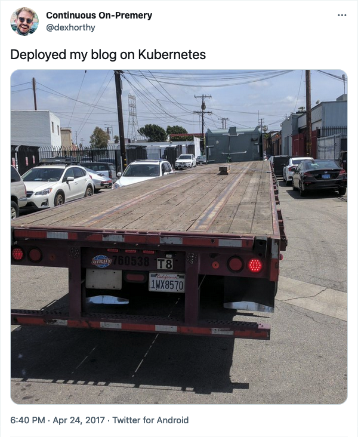

#### kochhaus-home - Home Cloud via Flux v2 | GitOps Toolkit

> GitOps state for my cluster using flux v2

[](https://k8s.io/)
[](https://github.com/haraldkoch/kochhaus-home/main)
[](https://github.com/haraldkoch/kochhaus-home/actions/workflows/schedule-renovate.yaml)
[](https://github.com/pre-commit/pre-commit)
[](https://github.com/marketplace/actions/super-linter)

[K3S](https://k3s.io/) test cluster on 5 [Arch Linux](https://www.archlinux.org/) hosts. Currently I have:
- Raspberry Pi 4b (4G) - control plane
- Raspberry Pi 4b (8G) with an external SSD
- Two VMs (6G) on my homelab compute server
- One VM (6G) on my homelab backup / media server

## Off-cluster support

- [registry](https://github.com/distribution/distribution) - I have a host running several instances of the OCI container registry as a pull-through cache for each of the major internet container registries.
- [named](https://www.isc.org/bind/) - primary home DNS running on a pair of (redundant) Raspberry Pi 3s.
- [blocky](https://github.com/0xERR0R/blocky) - lightweight ad-blocking DNS resolver - this is replacing Pi-Hole.

## Cluster components

- [Flux 2](https://github.com/fluxcd/flux2) - GitOps manager that configures the cluster entirely from this GitHub repository.
- [SOPS](https://toolkit.fluxcd.io/guides/mozilla-sops/) - Encrypts secrets which is safe to store - even to a public repository.

### Networking

- [calico](https://www.tigera.io/project-calico/) - container networking with IPv6 support and policy enforcement.
- [cert-manager](https://cert-manager.io/docs/) - Configured to create TLS certs for all ingress services automatically using LetsEncrypt.
- [external-dns](https://github.com/kubernetes-sigs/external-dns) - monitors service and ingress resources, and automatically generates DNS updates for them. This lets me maintain DNS mappings and LetsEncrypt certificates without a cloudflare account or domain.
- [metallb](https://metallb.universe.tf/) - Kubernetes Load Balancer that runs on Kubernetes.
- [traefik ingress](https://doc.traefik.io/traefik/providers/kubernetes-ingress/) - Ingress controller based on Traefik (but not Rancher's default)

### Storage

- [democratic-csi](https://github.com/democratic-csi/democratic-csi) - creates Persistent Volumes on a ZFS server as separate datasets, and exports them via NFS or iSCSI to the Kubernetes cluter.
- [nfs-subdir-external-provisioner](https://github.com/kubernetes-sigs/nfs-subdir-external-provisioner) - creates Persistent Volumes on a pre-existing NFS mount.
- [rook-ceph](https://rook.io/) - on-cluster (hyperconverged) storage - eventually this will all be on SSDs attached to the cluster nodes for low power usage.

### infrastructure

- [descheduler](https://github.com/kubernetes-sigs/descheduler) - analyzes the cluster looking for overloaded or under-utilized nodes, as well as pods violating affinity rules, and evicts them so that they will be rescheduled "correctly".
- [kube-fledged](https://github.com/senthilrch/kube-fledged) - caches critical images locally on each node for reliability during an Internet outage.
- [kured](https://github.com/weaveworks/kured) - The Kubernetes Reboot Daemon.
- [prometheus](https://github.com/prometheus-community/helm-charts/tree/main/charts/kube-prometheus-stack) - metrics, monitoring, and alerting.
- [reloader](https://github.com/stakater/Reloader) - reloads pods when a configMap and/or Secret changes - something that Flux 2 does not manage itself.
- [system-upgrade-controller](https://github.com/rancher/system-upgrade-controller) - Automatically upgrade the K3S kubernetes instance.
- [velero](https://velero.io/): backups!
- [cloudnative-pg](https://cloudnative-pg.io/) - build and manage a postgresql cluster with HA and backups from a custom resource.
- [ext-postgres-operator](https://github.com/movetokube/postgres-operator) - create databases and users in an existing postgres cluster.
- [authentik](https://goauthentik.io/) - integrated authentication and user management.
- And more!

## Home Infrastructure

- [hajimari](https://github.com/toboshii/hajimari): a pretty start page with Kubernetes autodiscovery.
- [openweathermap-exporter](https://github.com/blackrez/openweathermap_exporter): a Prometheus exporter for Openweather.
- [weather-exporter](https://github.com/celliott/weather_exporter): the much older weather exporter using the DarkSky API.

## Applications

- [bookstack](https://www.bookstackapp.com/) - full featured documentation platform.
- [tautulli](https://github.com/Tautulli/Tautulli) - Plex usage monitoring application.
- [onedrive](https://github.com/abraunegg/onedrive) - syncs my OneDrive folder from Microsoft, as a local backup.
- [syncthing](https://syncthing.net/) - simple, peer-to-peer file synch app replacing Dropbox or NextCloud.
- [drone](https://readme.drone.io/) - CI/CD tool
- [actions-runner](https://github.com/actions-runner-controller/actions-runner-controller) - Run GitHub Actions at home!

Yes, this is a lot of infrastructure and heavy lifting - the point is to experiment with Kubernetes and GitOps in a safe space.

[](https://twitter.com/dexhorthy/status/856639005462417409)

I have two longer-term goals:

1. migrate many of the apps that I currently run on Linode to a K8S cluster at Linode or Digital Ocean.
2. Build a small Raspberry Pi cluster at home to run a lot of infrastructure, with the intent of being able to run off a small UPS during power outages.

---

## Repository structure

The Git repository contains the following directories under `cluster` and are ordered below by how Flux will apply them.

```sh
📁 cluster      # k8s cluster defined as code
├─📁 flux       # flux, gitops operator, loaded before everything
├─📁 crds       # custom resources, loaded before 📁 core and 📁 apps
├─📁 charts     # helm repos, loaded before 📁 core and 📁 apps
├─📁 config     # cluster config, loaded before 📁 core and 📁 apps
├─📁 core       # crucial apps, namespaced dir tree, loaded before 📁 apps
└─📁 apps       # regular apps, namespaced dir tree, loaded last
```

---

## Automation

- [Flux 2](https://github.com/fluxcd/flux2) - GitOps automation for Kubernetes.
- Rancher [System Upgrade Controller](https://github.com/rancher/system-upgrade-controller) to apply updates to k3s.
- [Renovate](https://github.com/renovatebot/renovate) with the help of the [k8s-at-home/renovate-helm-releases](https://github.com/k8s-at-home/renovate-helm-releases) Github action keeps my application charts and container images up-to-date.
- [Github Actions](https://docs.github.com/en/actions) automatically runs renovate.
- Many, many kubernetes operators

---

## Community

This cluster in inspired by the work of others shared at [awesome-home-kubernetes](https://github.com/k8s-at-home/awesome-home-kubernetes).
